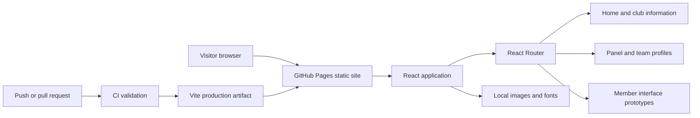

# System architecture

## Purpose and scope

ARPC is a client-rendered website for Ahsanullah Roh. Peace Club at AUST. Its implemented responsibilities are club information, event presentation, team profiles, affiliations and member interface prototypes.

There is no implemented backend, database, session service or certificate generator. Team and profile data are placeholders, and event content is defined in the frontend. This document describes the existing system; future services are explicitly identified as future work.

## Requirements

| Requirement | Current approach |
| --- | --- |
| Present club information across device sizes | React components with responsive Tailwind layouts. |
| Support navigation on a static host | React Router, with hash routing for GitHub Pages. |
| Serve assets under a repository URL | Vite's base setting and the `publicAsset()` helper. |
| Validate changes before deployment | Locked installation, ESLint, Vitest, npm audit, build verification and CodeQL. |
| Keep generated files out of source control | A repository-level `.gitignore`. |

## Components and boundaries

| Component | Responsibility |
| --- | --- |
| `Frontend/src/App.jsx` | Chooses the router, declares routes and coordinates shared navigation/footer visibility. |
| `Frontend/src/Pages/` | Composes route-level screens: home, team, login, registration and profile. |
| `Frontend/src/Components/` | Implements reusable UI, carousels, the founder reflection and profile tabs. |
| Route transition context | Shares the previous/current route for transition behavior. |
| `Frontend/src/utils/publicAsset.js` | Prefixes static asset URLs with Vite's deployment base. |
| `Frontend/src/Config/api.js` | Provides an Axios client for a future API; it does not implement a service. |
| `Frontend/public/` | Supplies images, portraits, logos and locally served EB Garamond fonts. |

## Routes and data flow

| Route | Screen | Data source |
| --- | --- | --- |
| `/` | Home | Content and event/affiliation arrays in React components. |
| `/team` | Panel | Local sample committee and team member data. |
| `/profile` | Member profile | Sample user, event and certificate data held in component state. |
| `/login` | Login interface | Interface prototype; no authenticated session is established. |
| `/register` | Registration interface | Interface prototype; no member record is created. |

User input and carousel selections update React state. Public assets load from the same static deployment. There is no implemented server-side persistence or API contract to document.

## Deployment flow

The `CI/CD` workflow runs on pull requests, pushes to `main` and manual dispatch:

1. Check out source and select Node.js 24.
2. Run `npm ci`, lint, component/deployment tests and a high-severity dependency audit.
3. Build with `VITE_BASE_PATH=/ARPC-Final/` and `VITE_GITHUB_PAGES=true`.
4. Verify generated HTML/CSS asset URLs and packaged public files.
5. For successful `main` runs, upload the artifact and deploy through GitHub Pages.

CodeQL runs independently on pushes, pull requests and a weekly schedule. Dependabot proposes dependency and Actions updates. Deployment permissions are limited to the deploy job.

## Design decisions

| Decision | Benefit | Tradeoff |
| --- | --- | --- |
| Static frontend deployment | Simple delivery without application server operations. | Member accounts and persistent data require a future service. |
| Hash routing on Pages | Deep links refresh correctly without server rewrite rules. | Production URLs contain `#`. |
| Browser routing during local development | Conventional local URLs. | Both routing modes need deployment tests. |
| Local images and fonts | Deployment does not depend on external placeholder services. | Assets increase the repository and build size. |
| Component-local content and state | Straightforward frontend development. | Content updates require code changes and a new deployment. |

## Operational and security considerations

Keep `package-lock.json` committed so development and CI use the same versions. Fix failing audits rather than bypassing them. A reverted source change can be deployed through the usual pull request workflow; deployment artifacts are retained for three days.

All `VITE_*` configuration is public in the browser bundle. A future backend must enforce authentication, authorization, input validation and data access; frontend visibility alone cannot protect member information. See the [security policy](../.github/SECURITY.md) and [developer guide](DEVELOPMENT.md).

## Future work

Replace sample content with verified club data. Design the backend and its API contracts before connecting real accounts, registrations or certificates. Add integration tests when those flows exist.
